<div align="center">
  <h1>🍅 PomodoroJam</h1>
  <p>The social Pomodoro timer. Start a room, share the link, focus together.</p>

[](https://nextjs.org)
[](https://www.typescriptlang.org)
[](https://supabase.com)
[](https://vercel.com)
[](LICENSE)
[](https://github.com/MinitJain/pomodoro-jam/issues)

**[→ Try it live](https://pomodoro-jam.vercel.app)** · [Report a bug](https://github.com/MinitJain/pomodoro-jam/issues) · [Request a feature](https://github.com/MinitJain/pomodoro-jam/issues)

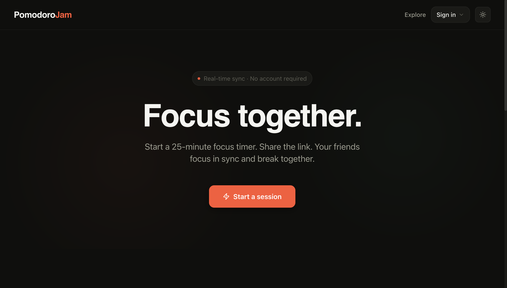
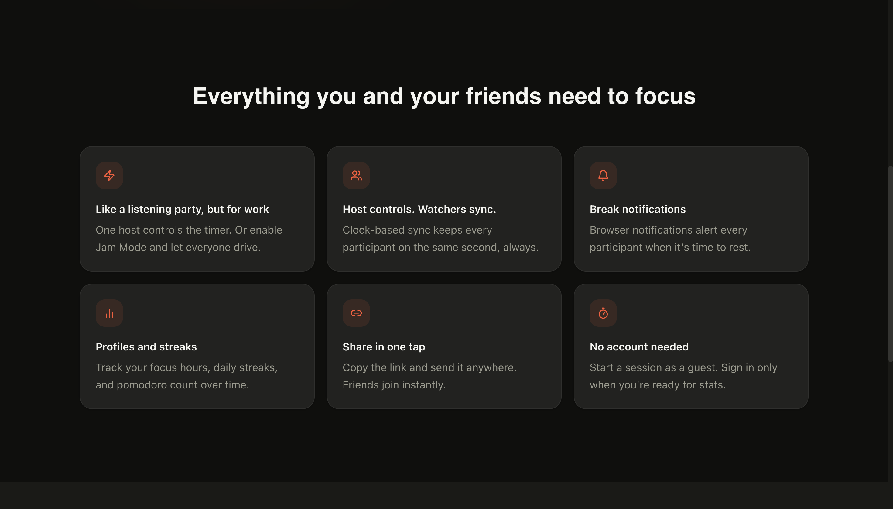
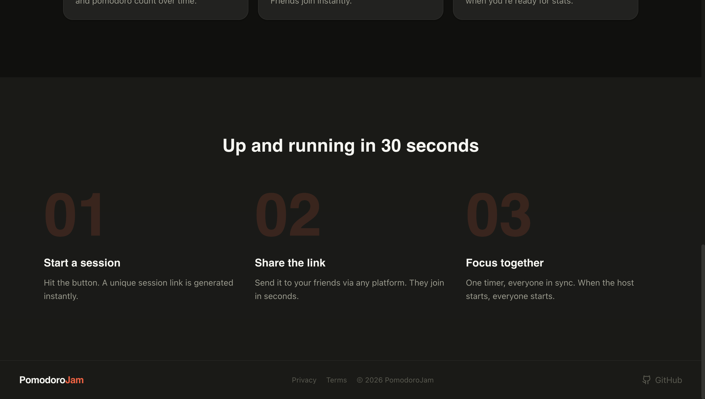

</div>

---

## Why PomodoroJam?

Every focus app is built for one person. Forest grows a tree — yours, alone. Notion tracks tasks — yours, alone. There is no app built around the fact that focusing with someone else is fundamentally different from focusing solo.

PomodoroJam is that app. Start a room, share the link — your friend joins and sees the exact same second on the exact same timer. When the break hits, it hits for everyone. The accountability is real because the other person is actually there.

---

## Features

### Synchronized Timer

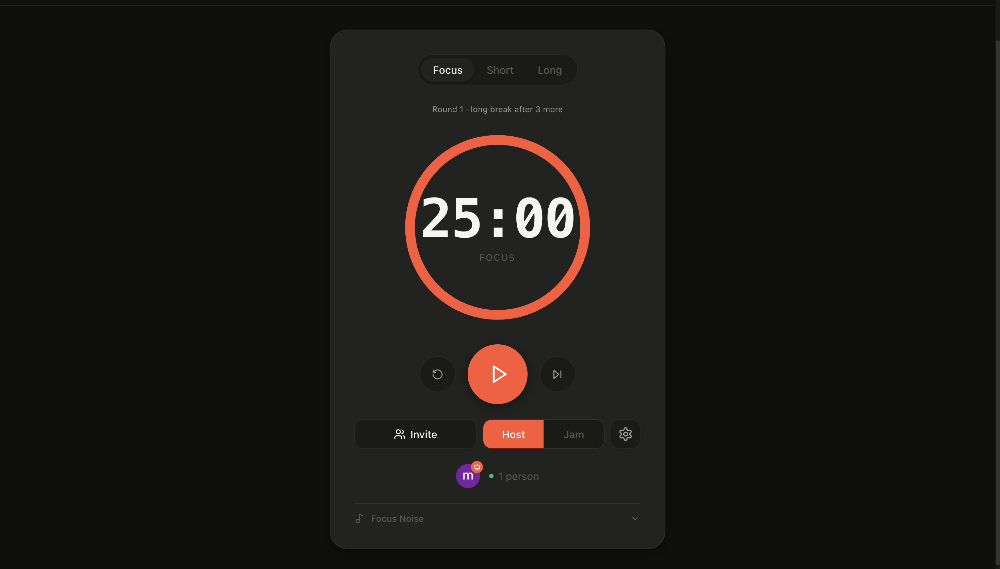
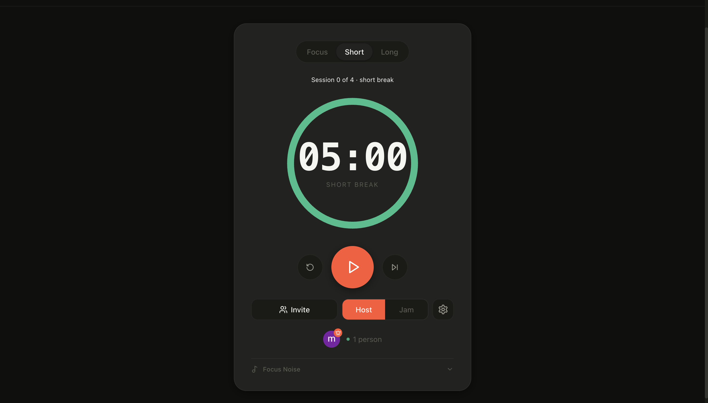
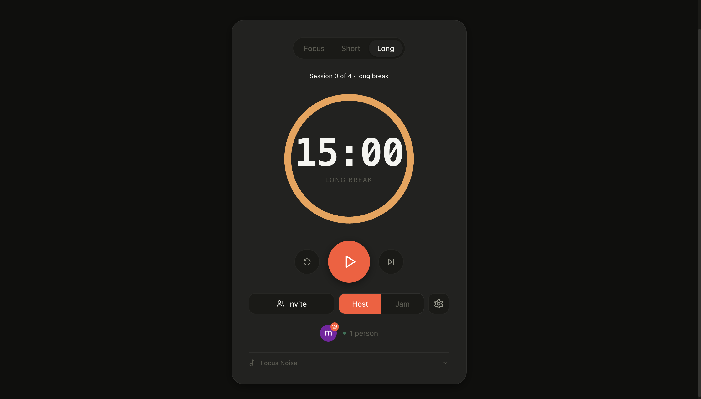

The timer is clock-based using a `startedAt` Unix timestamp rather than a local countdown. Everyone in the room — regardless of when they joined or how bad their connection is — always sees the correct second. No drift, no skew.

---

### Three Focus Modes

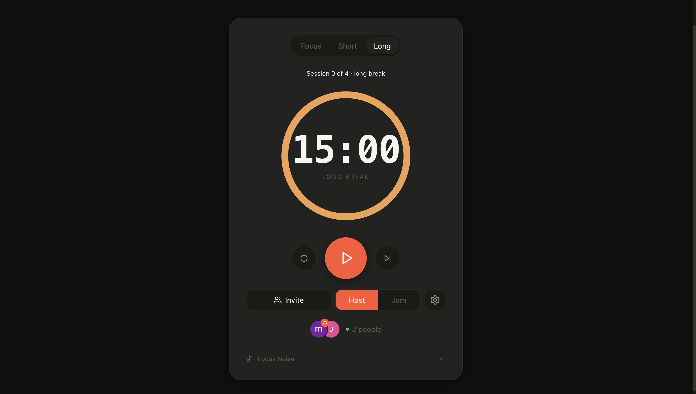
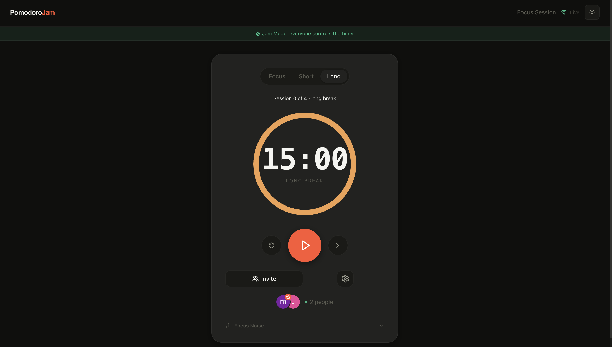

Every room has three modes, switchable at any time:

- **Host mode** — only the host can start, pause, skip, or change settings. Everyone else follows along in sync.
- **Jam mode** — anyone in the room can control the timer. Great for study groups where everyone has equal say.
- **Solo mode** — private room, no sharing, no watchers. Just you and the timer.

The current mode is visible to all participants in real time.

---

### Watcher Settings Requests

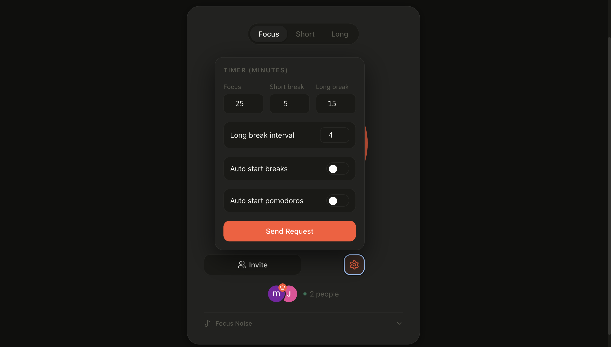

Watchers can't change settings directly, but they can request a change. The host receives an inline card showing exactly what the watcher wants to change — a diff of old vs. new values — and can accept or reject with one tap. If accepted, the settings apply immediately for everyone.

---

### Focus Noise

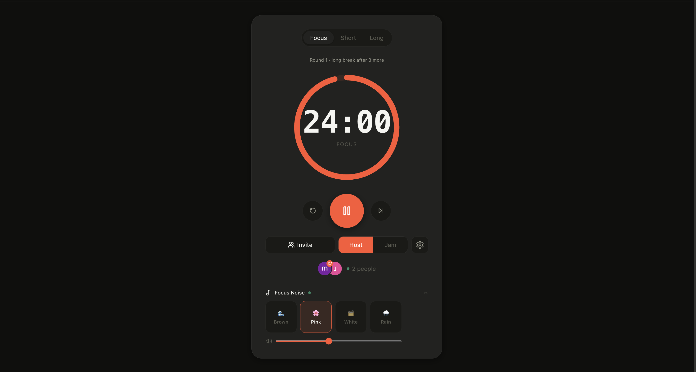

Four ambient sounds generated entirely by the Web Audio API — no CDN, no external files, no latency:

- 🟤 **Brown noise** — deep, rumbling background hum
- ⚪ **White noise** — broad-spectrum static
- 🌸 **Pink noise** — softer mid-range tone
- 🌧️ **Rain** — gentle rainfall texture

The panel is collapsible. A green pulse dot appears next to "Focus Noise" when a sound is active, so you always know something's playing.

---

### Live Participants & Activity Feed

See who's focusing alongside you via real-time presence. When someone joins or leaves, a floating activity message appears at the bottom of the screen. The same feed shows timer events — when someone starts, pauses, or skips — so the whole group stays in the loop without any chat.

---

### Guest Nicknames

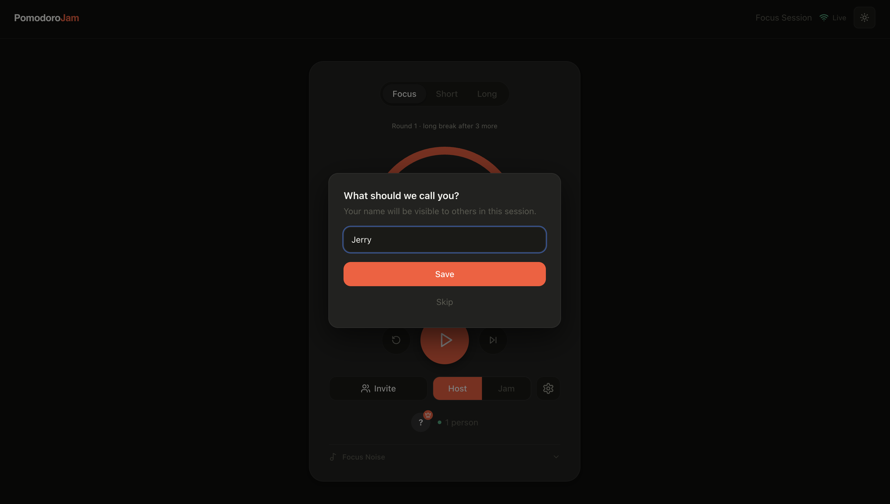

No account needed. Guests are prompted to set a display name when they first join a room. The name is saved per-room in `localStorage` so it persists across page reloads. It shows up in the participant list and activity feed for everyone.

---

### Timer Settings

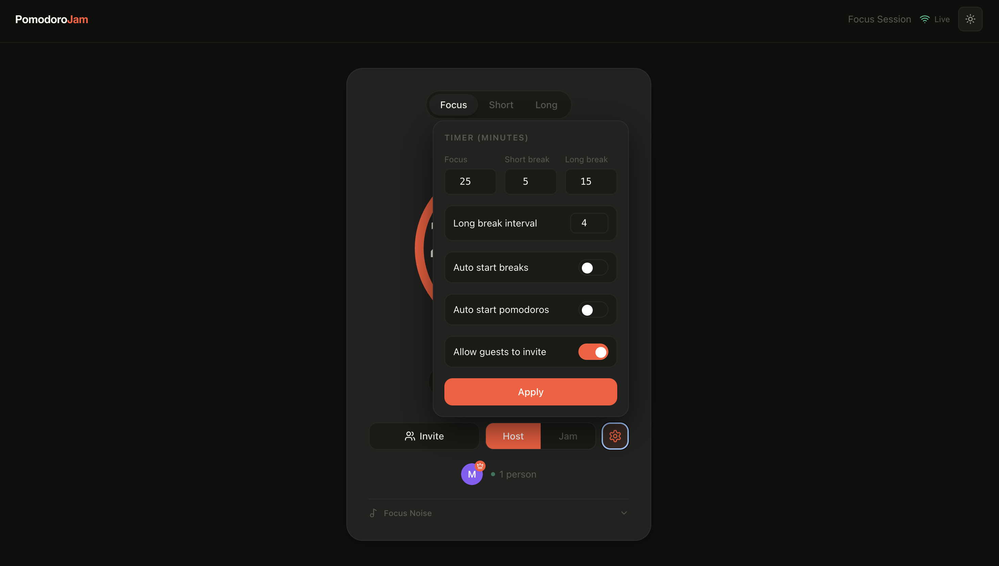

Fully configurable per-room:

- Focus, short break, and long break durations (in minutes)
- Long break interval (how many focus rounds before a long break)
- Auto-start breaks — break timer starts automatically when focus ends
- Auto-start pomodoros — focus timer restarts automatically after a break

Settings are persisted to the database and broadcast to all participants when applied.

---

### Break Overlay & Notifications

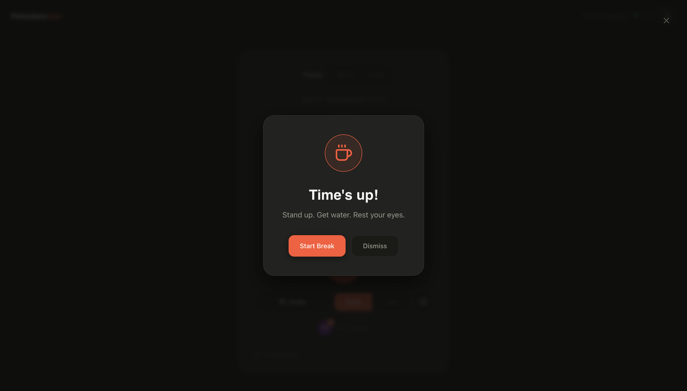

When the timer ends, a full-screen break overlay appears for all participants simultaneously. Browser push notifications fire at the same moment — useful if you've switched tabs. The overlay disappears as soon as the next round starts.

---

### Analytics Dashboard

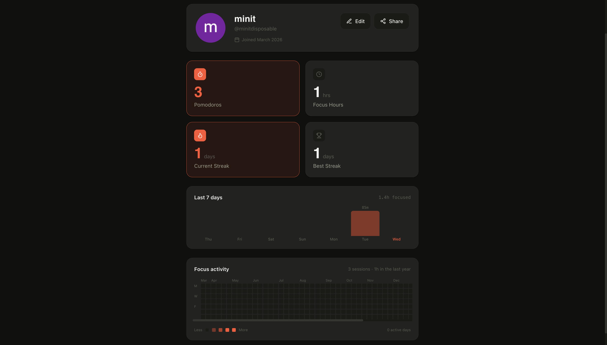

Authenticated users get a personal analytics dashboard at `/profile/[username]`:

- **Total pomodoros** and **focus hours** completed
- **Current streak** — consecutive days with at least one completed session
- **Weekly bar chart** — last 7 days of focus activity
- **GitHub-style heatmap** — 52-week calendar showing daily pomodoro counts

All data is logged to the `pomodoro_logs` table whenever a focus round completes.

---

### Explore Page

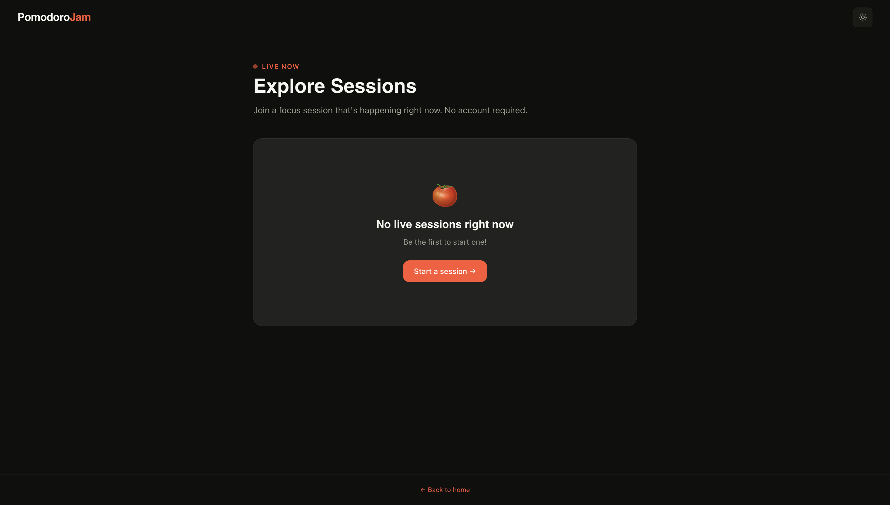

Browse all live public rooms happening right now without needing a direct link. The explore page shows active rooms updated in the last 90 seconds — room name, host, and current mode. Click any card to join instantly.

---

### One-Tap Share

The share panel lets you copy the room link or trigger the native OS share sheet on mobile. Guests can only share if the host has "Allow guests to invite" enabled in settings — the host controls whether the room is open or invite-only.

---

### Dark / Light Theme & PWA

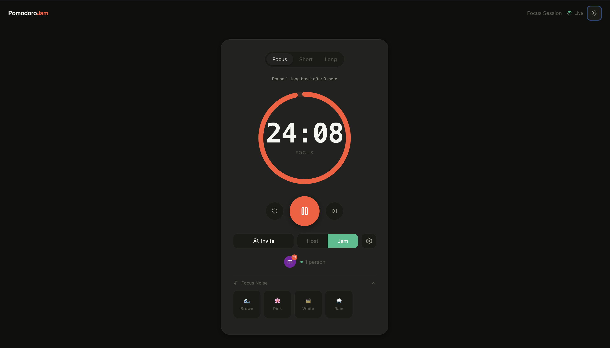
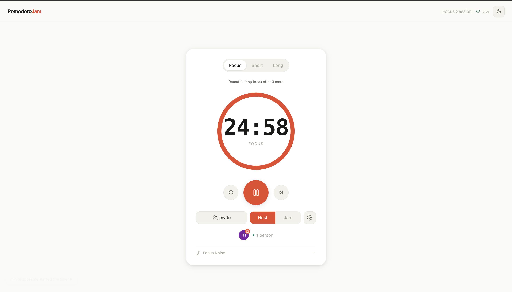

Theme toggles between dark and light, persisted per device. The app is installable as a PWA on mobile and desktop — the favicon and tab title update live with the current timer countdown.

---

## How it works

1. **Start** — click "Start a room" on the landing page
2. **Share** — hit the Invite button and send the link to anyone
3. **Pick your mode** — Host (you lead), Jam (everyone drives), or Solo (just you)
4. **Focus** — hit Play. Everyone sees the same countdown, on the same second
5. **Break** — timer ends, notifications fire, break overlay appears for everyone

No account needed. Start in under 30 seconds.

---

## Stack

| Layer      | Technology                            |
| ---------- | ------------------------------------- |
| Framework  | Next.js 14 App Router                 |
| Language   | TypeScript (strict)                   |
| Database   | Supabase (PostgreSQL + Realtime)      |
| Auth       | Supabase Auth (GitHub + Google OAuth) |
| Styling    | Tailwind CSS + CSS variables          |
| OG Images  | @vercel/og                            |
| Audio      | Web Audio API (no external deps)      |
| Fonts      | Syne + DM Sans + JetBrains Mono       |

---

## Getting Started

**Prerequisites:** Node.js 18+, a Supabase account (free), npm

**1. Clone and install**

```bash
git clone https://github.com/MinitJain/pomodoro-jam.git
cd pomodoro-jam
npm install
```

**2. Set up environment variables**

```bash
cp .env.local.example .env.local
```

Fill in your Supabase credentials:

```env
NEXT_PUBLIC_SUPABASE_URL=https://your-project.supabase.co
NEXT_PUBLIC_SUPABASE_ANON_KEY=your-anon-key
NEXT_PUBLIC_APP_URL=http://localhost:3000
```

**3. Set up the database**

Run the migrations in your Supabase SQL editor in order:

```text
supabase/migrations/001_init.sql
supabase/migrations/002_jam_mode.sql
supabase/migrations/003_rls_sessions.sql
supabase/migrations/004_session_expiry.sql
supabase/migrations/005_log_pomodoros.sql
supabase/migrations/006_session_mode.sql
```

Or push via the Supabase CLI:

```bash
npx supabase db push
```

**4. Enable OAuth providers**

Supabase → Authentication → Providers → enable GitHub and/or Google, add your Client ID and Secret.

**5. Run locally**

```bash
npm run dev
```

Open [http://localhost:3000](http://localhost:3000)

---

## Deploy to Vercel

[](https://vercel.com/new/clone?repository-url=https://github.com/MinitJain/pomodoro-jam)

After deploying, complete these three steps or auth will break:

1. Supabase → Authentication → URL Configuration → add your Vercel URL to **Redirect URLs**
2. Google Cloud Console → OAuth client → add your Vercel domain to **Authorized JavaScript origins**
3. Set `NEXT_PUBLIC_APP_URL` in Vercel environment variables to your live URL

---

## Contributing

PRs are welcome. For major changes, open an issue first.
This repo uses [CodeRabbit](https://coderabbit.ai) for AI code review — every PR gets reviewed automatically.

---

## License

MIT
